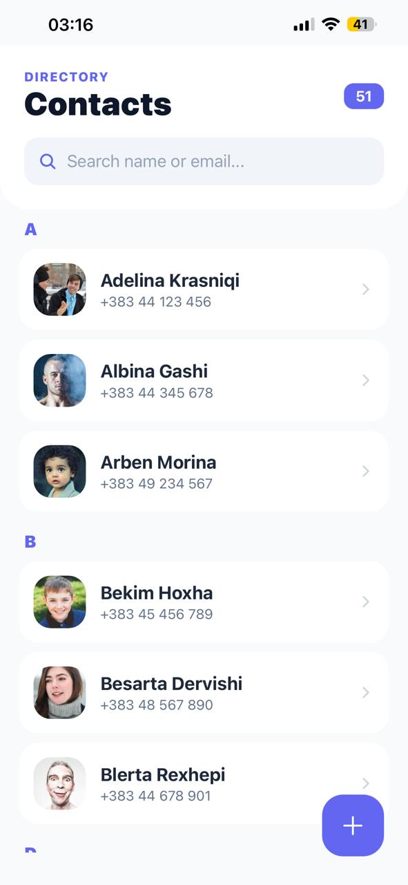
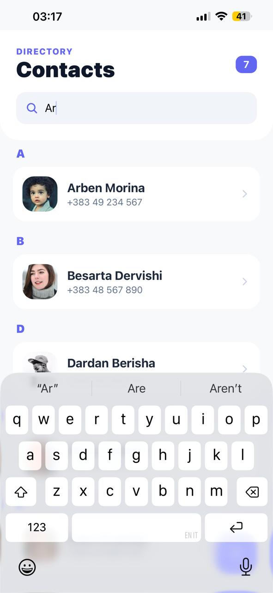
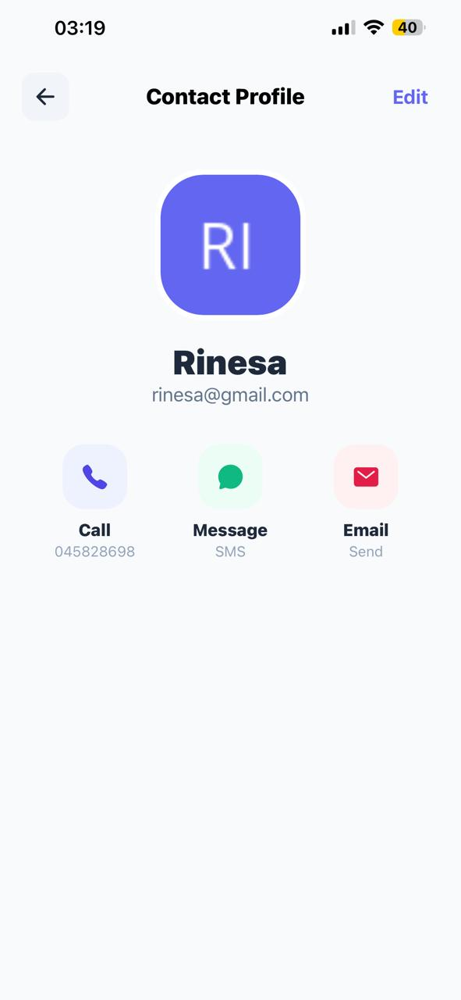
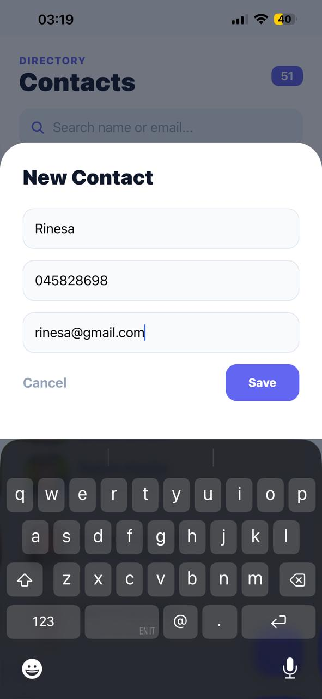
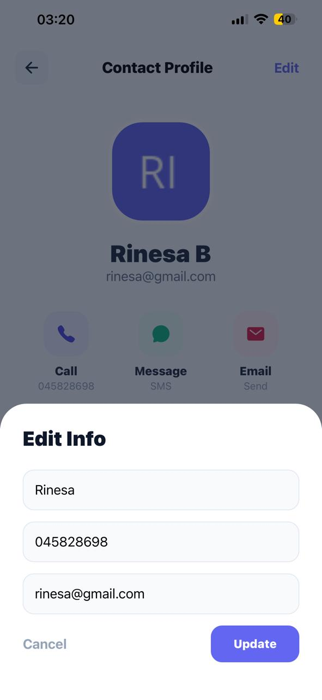
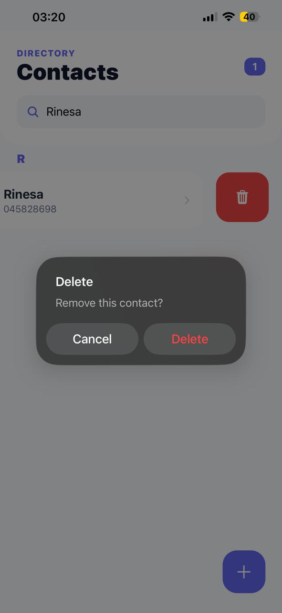

# 📱 Contact List App - React Native (Week 5 Project)

This is a production-quality Contact List application built as part of the **Mobile Application Development** course at the **University of Mitrovica**. The project focuses on handling large datasets, persistent storage, and modern UI/UX patterns.

## 🚀 Key Features

* **Optimized List Rendering**: Implements `SectionList` for high performance with 50+ contacts (Virtualization).
* **Alphabetical Grouping**: Automatically organizes contacts into A-Z sections for professional data management.
* **Real-time Search**: Instant filtering functionality by contact name or email address.
* **Persistent Storage**: Integrated with `AsyncStorage` to ensure user data is preserved after the app is closed.
* **Pull-to-Refresh**: Implementation of the bonus feature (**Slide 59**) to manually refresh the contact list.
* **Gesture-Based Actions**: Swipe-to-delete functionality using `react-native-gesture-handler`.
* **Dynamic Counter**: A header badge that tracks the total number of contacts in real-time.
* **Full CRUD**: Support for adding new contacts, editing existing info, and removing contacts.
* **Deep Linking**: Integration with native device apps for Call, SMS, and Email.
---

## 📸 Screenshots

| Home & Counter | Search & Groups | Profile Details | Add Contact | Edit Contact | Delete Contact |
| :---: | :---: | :---: | :---: |:---: |:---: |
|  |  |  | | |  |  


---

## 🛠️ Tech Stack

* **Framework**: React Native (Expo)
* **Navigation**: React Navigation (Native Stack)
* **Storage**: `@react-native-async-storage/async-storage`
* **Icons**: `@expo/vector-icons` (Ionicons)
* **Gestures**: `react-native-gesture-handler` (Swipeable components)

## 📂 Project Structure
    ```text
    .
    ├── App.js                 # Main logic, State management & Navigation
    ├── data/
    │   └── contact_data.json  # Initial mock dataset
    ├── assets/                # Local images and app icons
    ├── package.json           # Project dependencies and scripts
    └── README.md              # Project documentation


## ⚙️ Installation & Setup
1. **Clone the repository:**
    git clone [https://github.com/rinesabislimi28/ContactList.git](https://github.com/rinesabislimi28/ContactList.git)

2. **Install dependencies:**
    npm install

3. **Launch the application:**
    npx expo start

## 🏫 Academic Context
- Institution: University of Mitrovica
- Course: Mobile Application Development
- Assignment: Week 5 - Lists & Data Persistence
- Professor: Agon Bajgora

---

Developed by: Rinesa Bislimi - 2025